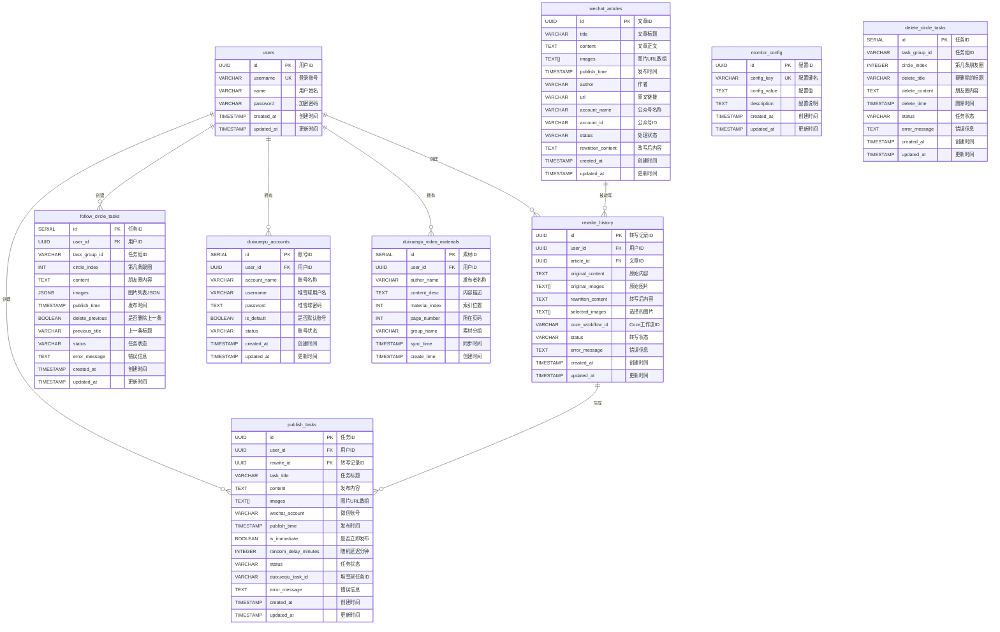
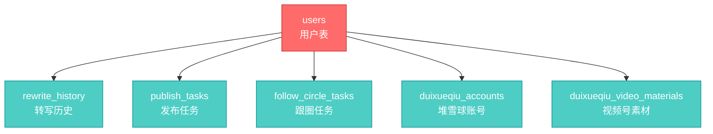
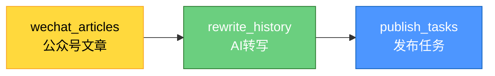
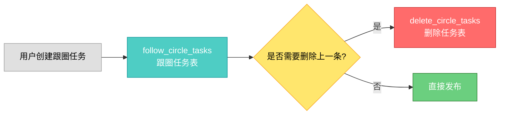

# 数据库文档

> **⚠️ 重要警告**: 修改数据库结构前必须阅读本文档和[危险操作警告](./危险操作警告.md)

**数据库类型**: PostgreSQL 15+
**托管平台**: Supabase
**最后更新**: 2025-11-12

---

## 📋 目录

- [数据库概述](#数据库概述)
- [核心约束和注意事项](#核心约束和注意事项)
- [数据库表清单](#数据库表清单)
- [ER图(可视化关系)](#er图可视化关系)
- [表结构详细说明](#表结构详细说明)
- [Supabase Storage配置](#supabase-storage配置)
- [索引和触发器](#索引和触发器)
- [数据库迁移历史](#数据库迁移历史)

---

## 📊 数据库概述

### 核心组件

本项目使用Supabase作为数据库平台,包含两个核心组件:

1. **PostgreSQL数据库** - 存储结构化数据
   - 9个核心表
   - UUID主键设计
   - 完善的外键约束
   - 自动时间戳

2. **Supabase Storage** - 存储文件(图片)
   - `follow-circle-images` Bucket
   - 公开访问策略
   - 自动清理机制
   - 1GB免费额度

### 技术特点

- ✅ **类型安全** - 使用UUID主键,避免ID冲突
- ✅ **关系完整** - 完善的外键约束和级联删除
- ✅ **性能优化** - 合理的索引设计
- ✅ **数据安全** - RLS策略保护
- ✅ **自动化** - 定时清理过期数据

---

## ⚠️ 核心约束和注意事项

### 🚨 绝对禁止的操作

1. **禁止修改主键类型**
   - `users.id` 是 `UUID` 类型,**绝对不能改为其他类型**
   - 所有关联表的 `user_id` **必须是 `UUID` 类型**
   - 修改会导致所有关联表的外键失效

2. **禁止删除表**
   - 删除表会导致数据丢失
   - 删除表会导致关联表的外键失效
   - **如果必须删除,必须先备份数据库**

3. **禁止修改字段类型**
   - 修改字段类型可能导致数据丢失
   - 修改字段类型可能导致应用程序报错
   - **如果必须修改,必须先创建迁移文件并测试**

4. **禁止删除迁移文件**
   - 迁移文件是数据库变更的历史记录
   - 删除会导致无法追溯变更
   - **绝对不要删除 `migrations/` 目录下的文件**

### ✅ 安全的操作

1. **查询数据** - 随时可以查询
2. **插入数据** - 注意字段类型和约束
3. **更新数据** - 注意不要修改关键字段
4. **创建索引** - 可以优化查询性能

### 📝 修改数据库的正确流程

1. **创建迁移文件** - 在 `migrations/` 目录下创建新的SQL文件
2. **在本地测试** - 先在本地数据库测试迁移
3. **备份数据库** - 在Supabase后台创建备份
4. **执行迁移** - 在生产环境执行迁移
5. **验证功能** - 测试所有相关功能是否正常
6. **准备回滚** - 如果出问题,立即回滚

---

## 📊 数据库表清单

### 核心表 (13个)

| 序号 | 表名 | 用途 | 主键类型 | 关联表 |
|------|------|------|---------|--------|
| 1 | `users` | 用户表 | UUID | 所有表 |
| 2 | `wechat_articles` | 公众号文章表 | UUID | rewrite_history, publish_tasks |
| 3 | `monitor_config` | 监控配置表 | UUID | - |
| 4 | `rewrite_history` | 转写历史表 | UUID | users, wechat_articles |
| 5 | `publish_tasks` | 发布任务表 | UUID | users, rewrite_history |
| 6 | `follow_circle_tasks` | 跟圈任务表 | SERIAL | users |
| 7 | `delete_circle_tasks` | 删除任务表 | SERIAL | - |
| 8 | `duixueqiu_accounts` | 堆雪球账号表 | SERIAL | users |
| 9 | `duixueqiu_video_materials` | 视频号素材表 | SERIAL | users |
| 10 | `duixueqiu_link_materials` | 链接素材表 | SERIAL | users |
| 11 | `duixueqiu_friends` | 堆雪球好友表 | BIGSERIAL | users |
| 12 | `wechat_subscriptions` | 公众号订阅表 | BIGSERIAL | users |
| 13 | `message_send_history` | 消息发送历史表 | BIGSERIAL | users, duixueqiu_friends |

### 表分类

**用户相关**:
- `users` - 用户基础信息

**公众号监控相关**:
- `wechat_articles` - 公众号文章
- `monitor_config` - 监控配置
- `rewrite_history` - 转写历史

**发布相关**:
- `publish_tasks` - 发布任务
- `follow_circle_tasks` - 跟圈任务
- `delete_circle_tasks` - 删除任务

**堆雪球相关**:
- `duixueqiu_accounts` - 堆雪球账号
- `duixueqiu_video_materials` - 视频号素材
- `duixueqiu_link_materials` - 链接素材
- `duixueqiu_friends` - 堆雪球好友列表

**微信好友触达相关**:
- `message_send_history` - 消息发送历史(防重复发送)

**公众号订阅相关**:
- `wechat_subscriptions` - 公众号订阅配置

---

## 🗺️ ER图(可视化关系)

### 完整ER图



---

### 核心表关系

#### 用户中心关系



**说明**:
- `users` 是核心表,所有业务表都关联到用户
- 所有关联表的 `user_id` **必须是UUID类型**
- 删除用户时,部分关联数据会被级联删除

---

#### 文章处理流程



**说明**:
- 公众号文章采集后存入 `wechat_articles`
- 用户选择文章进行AI转写,记录存入 `rewrite_history`
- 转写后创建发布任务,存入 `publish_tasks`

---

#### 跟圈任务流程



**说明**:
- 跟圈任务按 `task_group_id` 分组
- 每条跟圈有 `circle_index` 标识顺序
- 如果需要删除上一条,会创建删除任务

---

### 关键约束说明

#### 1. user_id类型约束

**⚠️ 最重要的约束**:
- `users.id` 是 `UUID` 类型
- **所有关联表的 `user_id` 必须是 `UUID` 类型**
- **绝对不能修改为其他类型**

**已修复的问题**:
- `duixueqiu_accounts.user_id` - 已通过迁移009修复为UUID
- `follow_circle_tasks.user_id` - 已通过迁移010修复为UUID

**教训**:
- 这个问题已经导致过一次系统崩溃
- **创建新表时必须确保user_id是UUID类型**

---

#### 2. 外键级联删除

**CASCADE删除**:
- `users` → `rewrite_history`: 删除用户时,转写历史被删除
- `users` → `follow_circle_tasks`: 删除用户时,跟圈任务被删除

**SET NULL**:
- `wechat_articles` → `rewrite_history`: 删除文章时,article_id设为NULL

**说明**:
- CASCADE删除用于用户私有数据
- SET NULL用于保留历史记录

---

#### 3. 唯一约束

**users表**:
- `username` - 登录账号必须唯一

**monitor_config表**:
- `config_key` - 配置键名必须唯一

**duixueqiu_video_materials表**:
- `(user_id, thumbnail_url)` - 防止重复素材(使用缩略图URL去重)

---

#### 4. 数组字段

**TEXT[]类型**:
- `wechat_articles.images` - 图片URL数组
- `rewrite_history.original_images` - 原始图片数组
- `rewrite_history.selected_images` - 选择的图片数组
- `publish_tasks.images` - 图片URL数组

**JSONB类型**:
- `follow_circle_tasks.images` - 图片URL数组(存储Storage URL)

**注意**:
- 数组字段不能直接用 `=` 比较
- 需要使用 `@>` 或 `&&` 等数组操作符

---

## 📝 表结构详细说明

### 1. users (用户表)

**用途**: 存储系统用户信息

**表结构**:

| 字段名 | 类型 | 约束 | 默认值 | 说明 |
|--------|------|------|--------|------|
| id | UUID | PRIMARY KEY | gen_random_uuid() | **用户ID,所有关联表的user_id必须是UUID类型** |
| username | VARCHAR(50) | UNIQUE NOT NULL | - | 登录账号,唯一 |
| name | VARCHAR(100) | NOT NULL | - | 用户姓名 |
| password | VARCHAR(255) | NOT NULL | - | 加密后的密码(bcrypt) |
| created_at | TIMESTAMP | - | NOW() | 创建时间 |
| updated_at | TIMESTAMP | - | NOW() | 更新时间(自动更新) |

**索引**:
- `idx_users_username` - username字段索引

**触发器**:
- `update_users_updated_at` - 自动更新updated_at字段

**⚠️ 重要约束**:
- **id字段是UUID类型,所有关联表的user_id必须也是UUID类型**
- **禁止修改id字段类型**
- **禁止删除或修改username字段**

---

### 2. wechat_articles (公众号文章表)

**用途**: 存储从公众号采集的文章信息

**表结构**:

| 字段名 | 类型 | 约束 | 默认值 | 说明 |
|--------|------|------|--------|------|
| id | UUID | PRIMARY KEY | gen_random_uuid() | 文章ID |
| title | VARCHAR(500) | NOT NULL | - | 文章标题 |
| content | TEXT | - | - | 文章正文(HTML格式) |
| images | TEXT[] | - | - | 文章图片URL数组 |
| publish_time | TIMESTAMP | - | - | 文章发布时间 |
| author | VARCHAR(100) | - | - | 文章作者 |
| url | VARCHAR(1000) | - | - | 文章原文链接 |
| account_name | VARCHAR(100) | - | - | 公众号名称 |
| account_id | VARCHAR(100) | - | - | 公众号ID |
| status | VARCHAR(50) | - | '待处理' | 处理状态 |
| rewritten_content | TEXT | - | - | AI改写后的内容 |
| created_at | TIMESTAMP | - | NOW() | 创建时间 |
| updated_at | TIMESTAMP | - | NOW() | 更新时间(自动更新) |

**索引**:
- `idx_articles_account_id` - account_id字段索引
- `idx_articles_publish_time` - publish_time字段索引(降序)
- `idx_articles_status` - status字段索引

**触发器**:
- `update_articles_updated_at` - 自动更新updated_at字段

**status字段可选值**:
- `待处理` - 刚采集,未处理
- `改写中` - 正在AI改写
- `已改写` - 改写完成
- `发布中` - 正在发布
- `已发布` - 发布完成
- `失败` - 处理失败

**⚠️ 重要约束**:
- images字段是数组类型,存储图片URL
- content字段存储HTML格式的文章内容
- status字段必须是预定义的值之一

---

### 3. monitor_config (监控配置表)

**用途**: 存储公众号监控的配置信息

**表结构**:

| 字段名 | 类型 | 约束 | 默认值 | 说明 |
|--------|------|------|--------|------|
| id | UUID | PRIMARY KEY | gen_random_uuid() | 配置ID |
| config_key | VARCHAR(100) | UNIQUE NOT NULL | - | 配置键名 |
| config_value | TEXT | NOT NULL | - | 配置值 |
| description | TEXT | - | - | 配置说明 |
| created_at | TIMESTAMP | - | NOW() | 创建时间 |
| updated_at | TIMESTAMP | - | NOW() | 更新时间(自动更新) |

**索引**:
- `idx_monitor_config_key` - config_key字段索引

**触发器**:
- `update_monitor_config_updated_at` - 自动更新updated_at字段

**默认配置**:
- `sync_interval_minutes` = `30` - 自动同步文章的时间间隔(分钟)

**⚠️ 重要约束**:
- config_key必须唯一
- 不要随意修改config_key,会影响系统功能

---

### 4. rewrite_history (转写历史表)

**用途**: 存储文章AI改写的历史记录

**表结构**:

| 字段名 | 类型 | 约束 | 默认值 | 说明 |
|--------|------|------|--------|------|
| id | UUID | PRIMARY KEY | gen_random_uuid() | 转写记录ID |
| user_id | UUID | FOREIGN KEY → users(id) | - | 用户ID,**必须是UUID类型** |
| article_id | UUID | FOREIGN KEY → wechat_articles(id) | - | 关联的文章ID |
| original_content | TEXT | NOT NULL | - | 原始文章内容 |
| original_images | TEXT[] | - | - | 原始图片URL数组 |
| rewritten_content | TEXT | NOT NULL | - | AI转写后的内容 |
| selected_images | TEXT[] | - | - | 用户选择的图片URL数组 |
| coze_workflow_id | VARCHAR(100) | - | - | Coze工作流ID |
| status | VARCHAR(50) | - | 'completed' | 转写状态 |
| error_message | TEXT | - | - | 错误信息 |
| created_at | TIMESTAMP | - | NOW() | 创建时间 |
| updated_at | TIMESTAMP | - | NOW() | 更新时间(自动更新) |

**索引**:
- `idx_rewrite_history_user_id` - user_id字段索引
- `idx_rewrite_history_article_id` - article_id字段索引
- `idx_rewrite_history_created_at` - created_at字段索引(降序)

**外键约束**:
- `user_id` → `users(id)` ON DELETE CASCADE
- `article_id` → `wechat_articles(id)` ON DELETE SET NULL

**触发器**:
- `update_rewrite_history_updated_at` - 自动更新updated_at字段

**status字段可选值**:
- `processing` - 处理中
- `completed` - 完成
- `failed` - 失败

**⚠️ 重要约束**:
- **user_id必须是UUID类型,与users.id类型一致**
- 删除用户时,相关转写历史会被级联删除
- 删除文章时,article_id会被设置为NULL

---

### 5. publish_tasks (发布任务表)

**用途**: 存储朋友圈发布任务

**表结构**:

| 字段名 | 类型 | 约束 | 默认值 | 说明 |
|--------|------|------|--------|------|
| id | UUID | PRIMARY KEY | gen_random_uuid() | 任务ID |
| user_id | UUID | NOT NULL | - | 用户ID,**必须是UUID类型** |
| rewrite_id | UUID | - | - | 关联的转写记录ID |
| task_title | VARCHAR(255) | - | - | 任务标题 |
| content | TEXT | NOT NULL | - | 发布内容 |
| images | TEXT[] | - | - | 图片URL数组 |
| wechat_account | VARCHAR(100) | - | - | 微信账号 |
| publish_time | TIMESTAMP | NOT NULL | - | 发布时间 |
| is_immediate | BOOLEAN | - | false | 是否立即发布 |
| random_delay_minutes | INTEGER | - | 0 | 随机延迟分钟数 |
| status | VARCHAR(50) | - | 'pending' | 任务状态 |
| duixueqiu_task_id | VARCHAR(100) | - | - | 堆雪球任务ID |
| error_message | TEXT | - | - | 错误信息 |
| created_at | TIMESTAMP | - | NOW() | 创建时间 |
| updated_at | TIMESTAMP | - | NOW() | 更新时间(自动更新) |

**索引**:
- `idx_publish_tasks_user_id` - user_id字段索引
- `idx_publish_tasks_publish_time` - publish_time字段索引
- `idx_publish_tasks_status` - status字段索引

**触发器**:
- `update_publish_tasks_updated_at` - 自动更新updated_at字段

**status字段可选值**:
- `pending` - 待发布
- `processing` - 发布中
- `completed` - 已完成
- `failed` - 失败

**⚠️ 重要约束**:
- **user_id必须是UUID类型**
- images字段是数组类型
- publish_time不能为空

---

## 🔗 表关联关系

### 外键关系图

```
users (id: UUID)
  ├─→ rewrite_history (user_id: UUID) [CASCADE]
  ├─→ publish_tasks (user_id: UUID)
  ├─→ follow_circle_tasks (user_id: UUID) [CASCADE]
  └─→ duixueqiu_accounts (user_id: UUID)

wechat_articles (id: UUID)
  └─→ rewrite_history (article_id: UUID) [SET NULL]

rewrite_history (id: UUID)
  └─→ publish_tasks (rewrite_id: UUID)
```

### 关键约束说明

1. **users → rewrite_history**: CASCADE删除
   - 删除用户时,相关转写历史会被自动删除

2. **wechat_articles → rewrite_history**: SET NULL
   - 删除文章时,转写历史的article_id会被设置为NULL,保留转写记录

3. **users → follow_circle_tasks**: CASCADE删除
   - 删除用户时,相关跟圈任务会被自动删除

---

## 📌 索引和触发器

### 自动更新触发器

所有表都有 `updated_at` 字段自动更新触发器:

```sql
CREATE OR REPLACE FUNCTION update_updated_at_column()
RETURNS TRIGGER AS $$
BEGIN
    NEW.updated_at = NOW();
    RETURN NEW;
END;
$$ language 'plpgsql';
```

### 重要索引

**性能优化索引**:
- `idx_articles_publish_time` - 按发布时间降序查询文章
- `idx_rewrite_history_created_at` - 按创建时间降序查询转写历史
- `idx_publish_tasks_publish_time` - 按发布时间查询任务

**查询优化索引**:
- `idx_articles_status` - 按状态筛选文章
- `idx_publish_tasks_status` - 按状态筛选任务

---

### 6. follow_circle_tasks (跟圈任务表)

**用途**: 存储自动跟圈发布任务

**表结构**:

| 字段名 | 类型 | 约束 | 默认值 | 说明 |
|--------|------|------|--------|------|
| id | SERIAL | PRIMARY KEY | - | 任务ID(自增) |
| user_id | UUID | FOREIGN KEY → users(id) | - | 用户ID,**必须是UUID类型** |
| task_group_id | VARCHAR(100) | NOT NULL | - | 任务组ID(例如:跟圈_1730000000000) |
| circle_index | INT | NOT NULL | - | 第几条跟圈(1,2,3...) |
| content | TEXT | NOT NULL | - | 朋友圈文字内容 |
| images | JSONB | - | - | 图片列表JSON |
| publish_time | TIMESTAMP | NOT NULL | - | 计划发布时间 |
| delete_previous | BOOLEAN | - | false | 是否需要删除上一条朋友圈 |
| previous_title | VARCHAR(200) | - | - | 上一条朋友圈的标题(用于识别删除) |
| status | VARCHAR(20) | - | 'pending' | 任务状态 |
| error_message | TEXT | - | - | 错误信息 |
| created_at | TIMESTAMP | - | CURRENT_TIMESTAMP | 创建时间 |
| updated_at | TIMESTAMP | - | CURRENT_TIMESTAMP | 更新时间 |

**索引**:
- `idx_follow_circle_tasks_group` - task_group_id字段索引
- `idx_follow_circle_tasks_status` - status字段索引
- `idx_follow_circle_tasks_publish_time` - publish_time字段索引

**外键约束**:
- `user_id` → `users(id)` ON DELETE CASCADE

**status字段可选值**:
- `pending` - 待执行
- `completed` - 已完成
- `failed` - 失败

**⚠️ 重要约束**:
- **user_id必须是UUID类型** (已通过迁移010修复)
- images字段是JSONB类型,存储格式: `[{url: '', base64: ''}]`
- task_group_id用于关联同一批跟圈任务

---

### 7. delete_circle_tasks (删除任务表)

**用途**: 存储跟圈删除任务

**表结构**:

| 字段名 | 类型 | 约束 | 默认值 | 说明 |
|--------|------|------|--------|------|
| id | SERIAL | PRIMARY KEY | - | 任务ID(自增) |
| task_group_id | VARCHAR(255) | NOT NULL | - | 任务组ID(例如:跟圈_1729872000000) |
| circle_index | INTEGER | NOT NULL | - | 第几条朋友圈(1,2,3...) |
| delete_title | VARCHAR(255) | NOT NULL | - | 要删除的任务标题 |
| delete_content | TEXT | NOT NULL | - | 朋友圈内容(用于双重验证) |
| delete_time | TIMESTAMP | NOT NULL | - | 删除时间 |
| status | VARCHAR(20) | - | 'pending' | 任务状态 |
| error_message | TEXT | - | - | 错误信息 |
| created_at | TIMESTAMP | - | NOW() | 创建时间 |
| updated_at | TIMESTAMP | - | NOW() | 更新时间 |

**索引**:
- `idx_delete_circle_tasks_group` - task_group_id字段索引
- `idx_delete_circle_tasks_status` - status字段索引

**status字段可选值**:
- `pending` - 待执行
- `completed` - 已完成
- `failed` - 失败

**⚠️ 重要约束**:
- delete_content用于双重验证,确保删除正确的朋友圈
- task_group_id与follow_circle_tasks表关联

---

### 8. duixueqiu_accounts (堆雪球账号表)

**用途**: 存储堆雪球账号信息

**表结构**:

| 字段名 | 类型 | 约束 | 默认值 | 说明 |
|--------|------|------|--------|------|
| id | SERIAL | PRIMARY KEY | - | 账号ID(自增) |
| user_id | UUID | NOT NULL | - | 用户ID,**必须是UUID类型** |
| account_name | VARCHAR(100) | NOT NULL | - | 账号名称(用户自定义) |
| username | VARCHAR(100) | NOT NULL | - | 堆雪球用户名 |
| password | TEXT | NOT NULL | - | 堆雪球密码(明文存储,待加密) |
| is_default | BOOLEAN | - | false | 是否默认账号 |
| status | VARCHAR(20) | - | 'active' | 账号状态 |
| created_at | TIMESTAMP | - | CURRENT_TIMESTAMP | 创建时间 |
| updated_at | TIMESTAMP | - | CURRENT_TIMESTAMP | 更新时间 |

**索引**:
- `idx_duixueqiu_accounts_user_id` - user_id字段索引
- `idx_duixueqiu_accounts_status` - status字段索引

**status字段可选值**:
- `active` - 激活
- `inactive` - 停用

**⚠️ 重要约束**:
- **user_id必须是UUID类型** (已通过迁移009修复)
- **密码当前是明文存储,需要后续添加加密**
- 每个用户可以有多个堆雪球账号
- is_default标记默认使用的账号

**🚨 安全警告**:
- 密码明文存储存在安全风险
- 建议后续添加加密功能

---

### 9. duixueqiu_video_materials (视频号素材表)

**用途**: 存储堆雪球视频号素材库

**表结构**:

| 字段名 | 类型 | 约束 | 默认值 | 说明 |
|--------|------|------|--------|------|
| id | SERIAL | PRIMARY KEY | - | 素材ID(自增) |
| user_id | UUID | NOT NULL | - | 用户ID,**必须是UUID类型** |
| author_name | VARCHAR(200) | - | - | 视频号发布者名称 |
| content_desc | TEXT | - | - | 视频号内容描述(带话题标签) |
| material_index | INT | - | - | 素材在列表中的索引位置 |
| page_number | INT | - | 1 | 素材所在页码 |
| group_name | VARCHAR(100) | - | '公共素材分组' | 素材分组 |
| sync_time | TIMESTAMP | - | NOW() | 最后同步时间 |
| create_time | TIMESTAMP | - | NOW() | 创建时间 |

**索引**:
- `idx_duixueqiu_video_materials_user_id` - user_id字段索引
- `idx_duixueqiu_video_materials_author_name` - author_name字段索引
- `idx_duixueqiu_video_materials_sync_time` - sync_time字段索引

**唯一约束**:
- `UNIQUE(user_id, author_name, content_desc)` - 防止重复素材

**⚠️ 重要约束**:
- user_id必须是UUID类型
- 唯一约束防止同一用户重复添加相同素材
- material_index用于Puppeteer定位素材位置

---

### 9. message_send_history (消息发送历史表)

**用途**: 记录微信好友触达任务的消息发送历史,实现防重复发送和暂停/恢复功能

**表结构**:

| 字段名 | 类型 | 约束 | 默认值 | 说明 |
|--------|------|------|--------|------|
| id | BIGSERIAL | PRIMARY KEY | - | 自增主键 |
| user_id | UUID | NOT NULL | - | 用户ID(关联users表) |
| friend_id | BIGINT | NOT NULL | - | 好友ID(关联duixueqiu_friends表) |
| friend_name | TEXT | NOT NULL | - | 好友名称 |
| message_type | TEXT | NOT NULL | - | 消息类型(text/video/link/image/combined) |
| message_content_hash | TEXT | NOT NULL | - | 消息内容SHA-256哈希值 |
| message_content | JSONB | NOT NULL | - | 完整消息内容 |
| sent_at | TIMESTAMP WITH TIME ZONE | - | NOW() | 发送时间 |
| task_id | TEXT | - | - | 任务ID(可选) |
| created_at | TIMESTAMP WITH TIME ZONE | - | NOW() | 创建时间 |

**索引**:
- `idx_message_send_history_lookup` - (user_id, friend_id, message_content_hash)复合索引,用于快速查询
- `idx_message_send_history_sent_at` - sent_at字段索引(降序)
- `idx_message_send_history_user_id` - user_id字段索引

**CHECK约束**:
- `message_type IN ('text', 'video', 'link', 'image', 'combined')` - 限制消息类型

**⚠️ 重要约束**:
- **user_id必须是UUID类型** - 关联users表
- **friend_id必须是BIGINT类型** - 关联duixueqiu_friends表,不能是UUID
- message_content_hash用于快速比对,避免全文比对JSONB
- 复合索引(user_id, friend_id, message_content_hash)确保查询性能

**核心功能**:

1. **防重复发送**:
   - 发送前查询`(user_id, friend_id, message_content_hash)`
   - 如果存在记录,跳过该好友
   - 如果不存在,发送后插入记录

2. **暂停/恢复**:
   - 暂停时不需要特殊处理
   - 恢复时重新调用主函数
   - 依赖防重复机制自动跳过已发送的消息

3. **组合发送**:
   - 每种消息类型独立记录
   - 例如:发送文字+视频号,会插入2条记录
   - 恢复时只发送未记录的类型

**迁移文件**: `pyq-backend/supabase/migrations/20251201_create_message_send_history.sql`

**相关文档**:
- [脚本2文档 - 防重复发送机制](./脚本2-微信好友触达.md#1-防重复发送机制)
- [常见问题 - 暂停/恢复不工作](./常见问题与解决方案.md#q5-暂停恢复功能不工作重复发送消息-重要)

---

## 🗄️ Supabase Storage配置

### 方案概述

#### 问题背景

- **原方案**: 图片Base64直接存储在PostgreSQL数据库中
- **问题**: 10MB图片转Base64后约13-14MB,插入数据库时超过120秒超时限制
- **影响**: 跟圈任务创建失败,用户体验差

#### 解决方案

- **新方案**: 图片上传到Supabase Storage,数据库只存储图片URL
- **优势**:
  - ✅ 不会超时 - Storage专门处理大文件
  - ✅ 保持原图 - 不压缩,朋友圈看到的是原图质量
  - ✅ 免费使用 - 1GB免费额度够用很久
  - ✅ 速度更快 - 数据库只存URL,查询很快

---

### 技术架构

#### 数据流程

```
前端上传图片 (Base64)
    ↓
后端接收 (follow-circle.service.ts)
    ↓
上传到Storage (storage.service.ts)
    ↓
返回图片URL
    ↓
数据库存储URL (follow_circle_tasks表)
    ↓
发布时下载图片 (从Storage URL下载为Base64)
    ↓
上传到堆雪球 (Puppeteer自动化)
```

#### 文件结构

```
pyq-backend/src/
├── storage/
│   ├── storage.module.ts          # Storage模块
│   └── storage.service.ts         # Storage服务(核心)
├── automation/
│   ├── automation.module.ts       # 导入StorageModule
│   └── follow-circle.service.ts   # 使用StorageService
└── scheduler/
    └── scheduler.service.ts       # 定时清理任务
```

---

### Bucket配置

#### 创建Bucket

在Supabase控制台:
1. 进入 **Storage** → **New Bucket**
2. Bucket名称: `follow-circle-images`
3. **Public bucket**: ✅ 勾选
4. 点击 **Create bucket**

#### RLS策略配置

在Supabase SQL Editor执行:

```sql
-- 允许所有人上传 (INSERT)
CREATE POLICY "Allow public upload to follow-circle-images"
ON storage.objects FOR INSERT
WITH CHECK (bucket_id = 'follow-circle-images');

-- 允许所有人读取 (SELECT)
CREATE POLICY "Allow public read from follow-circle-images"
ON storage.objects FOR SELECT
USING (bucket_id = 'follow-circle-images');

-- 允许所有人更新 (UPDATE)
CREATE POLICY "Allow public update to follow-circle-images"
ON storage.objects FOR UPDATE
USING (bucket_id = 'follow-circle-images');

-- 允许所有人删除 (DELETE)
CREATE POLICY "Allow public delete from follow-circle-images"
ON storage.objects FOR DELETE
USING (bucket_id = 'follow-circle-images');
```

---

### 核心实现

#### Storage Service (storage.service.ts)

**上传图片**:
```typescript
async uploadFollowCircleImage(base64Data: string, taskGroupId: string, index: number): Promise<string> {
  // 1. 解析Base64数据,提取格式(jpg/png/jpeg)
  const matches = base64Data.match(/^data:image\/(png|jpg|jpeg);base64,(.+)$/);

  // 2. 生成安全的文件路径 - 避免中文字符
  const timestamp = taskGroupId.split('_').pop();
  const fileName = `${timestamp}_${index}.${ext}`;
  const folderName = `task_${timestamp}`;
  const filePath = `${folderName}/${fileName}`;

  // 3. 上传到Storage
  await this.supabase.storage
    .from('follow-circle-images')
    .upload(filePath, buffer, {
      contentType: `image/${ext}`,
      upsert: false,
    });

  // 4. 获取公开URL
  const { data: urlData } = this.supabase.storage
    .from('follow-circle-images')
    .getPublicUrl(filePath);

  return urlData.publicUrl;
}
```

**批量上传**:
```typescript
async uploadFollowCircleImages(base64Images: string[], taskGroupId: string): Promise<string[]> {
  const uploadPromises = base64Images.map((base64, index) =>
    this.uploadFollowCircleImage(base64, taskGroupId, index)
  );
  return Promise.all(uploadPromises);
}
```

**下载图片**:
```typescript
async downloadImageAsBase64(imageUrl: string): Promise<string> {
  // 1. 从URL提取文件路径
  const urlObj = new URL(imageUrl);
  const pathParts = urlObj.pathname.split('/');
  const filePath = pathParts.slice(-2).join('/');

  // 2. 从Storage下载
  const { data, error } = await this.supabase.storage
    .from('follow-circle-images')
    .download(filePath);

  // 3. 转换为Base64
  const buffer = Buffer.from(await data.arrayBuffer());
  const base64 = buffer.toString('base64');
  const ext = filePath.split('.').pop();

  return `data:image/${ext};base64,${base64}`;
}
```

---

### 定时清理任务

#### Scheduler Service (scheduler.service.ts)

```typescript
@Cron('0 3 * * *')  // 每天凌晨3点执行
async cleanOldFollowCircleImages() {
  this.logger.log('🧹 开始清理7天前的跟圈图片...');
  const deletedCount = await this.storageService.cleanOldFollowCircleImages();
  this.logger.log(`✅ 跟圈图片清理完成, 删除了 ${deletedCount} 个任务组的图片`);
}
```

#### 清理逻辑

```typescript
async cleanOldFollowCircleImages(): Promise<number> {
  // 1. 查询7天前完成的任务
  const sevenDaysAgo = new Date();
  sevenDaysAgo.setDate(sevenDaysAgo.getDate() - 7);

  const { data: oldTasks } = await this.supabase
    .from('follow_circle_tasks')
    .select('task_group_id')
    .eq('status', 'completed')
    .lt('updated_at', sevenDaysAgo.toISOString());

  // 2. 删除对应的图片
  for (const taskGroupId of taskGroupIds) {
    await this.deleteFollowCircleTaskImages(taskGroupId);
  }

  return deletedCount;
}
```

---

### 容量管理

#### 免费额度

- **Storage容量**: 1GB
- **数据库容量**: 500MB
- **单文件大小**: 最大50MB

#### 容量估算

- **单张图片**: 平均5MB
- **可存储**: 约200张图片
- **跟圈任务**: 每个任务约15-20MB
- **1GB可支持**: 约50个跟圈任务

#### 自动清理策略

1. **定时清理**: 每天凌晨3点清理7天前完成的任务图片
2. **容量监控**: 超过800MB时强制清理
3. **保留策略**: 最近7天的任务图片保留

---

### 故障排查

#### 问题1: 上传失败

**症状**: 图片上传到Storage失败

**检查**:
```bash
# 1. 检查Bucket是否存在
# 在Supabase控制台 Storage 中查看

# 2. 检查RLS策略
# 在Supabase SQL Editor执行:
SELECT * FROM storage.policies WHERE bucket_id = 'follow-circle-images';

# 3. 查看后端日志
pm2 logs pyq-backend | grep Storage
```

#### 问题2: 下载失败

**症状**: 从Storage下载图片失败

**检查**:
```bash
# 1. 检查URL是否正确
# URL格式: https://upcsdbcpmzpywvykiqtu.supabase.co/storage/v1/object/public/follow-circle-images/task_xxx/xxx.jpg

# 2. 检查文件是否存在
# 在Supabase控制台 Storage 中查看

# 3. 检查网络连接
curl -I "图片URL"
```

#### 问题3: 清理任务失败

**症状**: 定时清理任务没有执行

**检查**:
```bash
# 1. 查看定时任务日志
pm2 logs pyq-backend | grep "清理"

# 2. 检查Cron表达式
# '0 3 * * *' = 每天凌晨3点

# 3. 手动触发清理
# 在代码中调用 cleanOldFollowCircleImages()
```

---

## 📊 数据库迁移历史

### 迁移文件清单

| 文件名 | 执行时间 | 说明 |
|--------|---------|------|
| `004_create_delete_circle_tasks.sql` | 2025-10-25 | 创建删除任务表 |
| `005_create_follow_circle_tasks.sql` | 2025-10-27 | 创建跟圈任务表 |
| `006_add_content_type_to_follow_circle.sql` | 2025-10-27 | 添加内容类型字段 |
| `007_add_group_id_to_follow_circle.sql` | 2025-10-27 | 添加分组ID字段 |
| `008_create_duixueqiu_accounts.sql` | 2025-10-27 | 创建堆雪球账号表 |
| `009_add_user_id_to_follow_circle.sql` | 2025-10-27 | 添加user_id字段 |
| `009_fix_duixueqiu_accounts_user_id_type.sql` | 2025-10-29 | **修复user_id类型为UUID** |
| `009_fix_user_id_safe.sql` | 2025-10-29 | **安全修复user_id类型** |
| `010_fix_follow_circle_tasks_user_id.sql` | 2025-10-29 | **修复跟圈任务表user_id类型** |
| `011_create_duixueqiu_video_materials.sql` | 2025-11-10 | 创建视频号素材表 |

### 重要迁移说明

**user_id类型修复 (迁移009和010)**:
- **问题**: 初始创建时user_id是INTEGER类型
- **影响**: 与users.id(UUID)类型不匹配,无法建立外键
- **解决**: 通过迁移009和010修复为UUID类型
- **教训**: **创建表时必须确保user_id是UUID类型**

**⚠️ 重要警告**:
- 这个问题已经修复过一次
- **绝对不要再次修改user_id类型**
- **新建表时必须确保user_id是UUID类型**

---

## 📚 相关文档

- [危险操作警告](./危险操作警告.md) - **必读!** 禁止的操作和注意事项
- [关键配置信息](./关键配置信息.md) - 数据库连接和配置
- [部署指南](./部署指南.md) - 数据库迁移和部署流程

---

[← 返回README](./README.md)

---

**最后更新**: 2025-11-12
**维护者**: 小牛马

